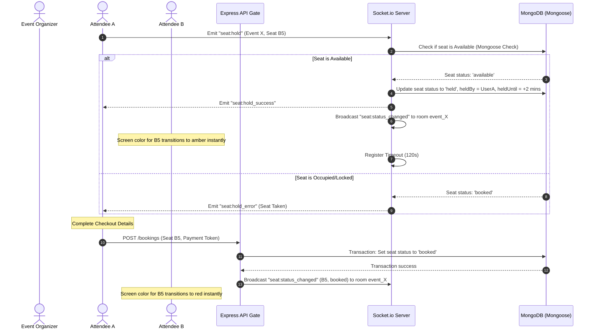
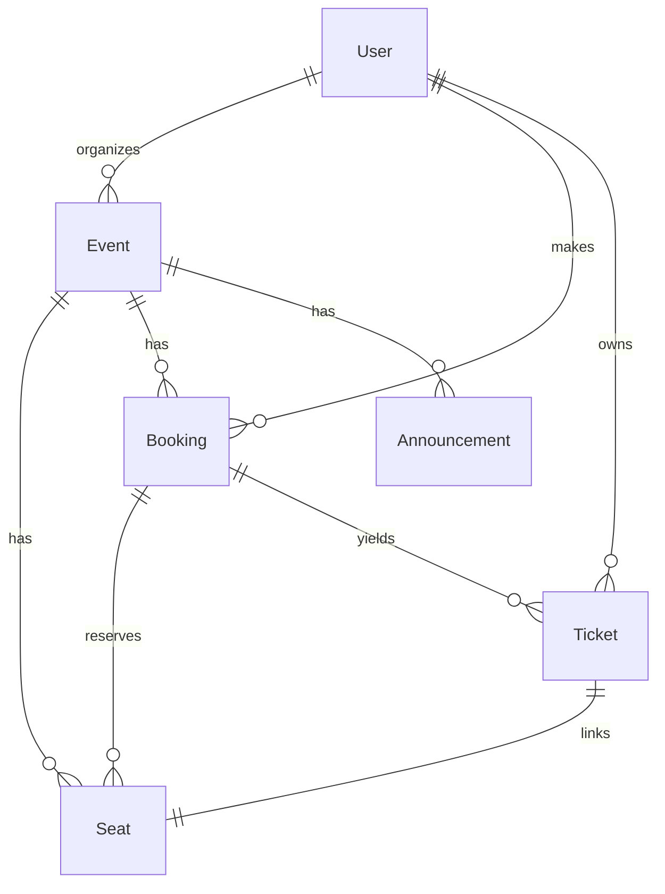

# EventHub | Tech Conference Event Management Platform

EventHub is an enterprise-grade, real-time ticket booking and seating management engine designed specifically for technical conferences, summits, and large-scale tech events. It features dynamic, interactive seating grids, room-scoped state updates, transactional concurrency controls, and cryptographic attendee gate check-ins.

🌐 **Production Deployment (Vercel)**: [https://frontend-beryl-two-18.vercel.app](https://frontend-beryl-two-18.vercel.app)

---

# ⚡ Concurrency & Architectural Blueprint

## 1. Collaborative State Machine (Socket.io Rooms)
Rather than broadcasting seat state mutations globally (which degrades network throughput and creates client-side lag), EventHub scopes active sessions using resource-bound channels: `event_${eventId}`.



## 2. Double-Booking Prevention (Transactional Integrity)
To guarantee that two users checking out at the exact same millisecond cannot book the same seat, EventHub utilizes:
- **Compound Database Constraints**: `SeatSchema.index({ event: 1, row: 1, number: 1 }, { unique: true })` preventing duplication at the MongoDB database layout layer.
- **Mongoose Transactional Sessions**: The booking controllers detect if the MongoDB deployment is a Replica Set (e.g. MongoDB Atlas production instances) and automatically wrap seat lookups, pricing assessments, and booking insertions inside a database transaction session. If any validation fails, the transaction is immediately aborted.
- **Standalone Compatibility Layer**: In standalone development environments (where replica sets are not active), it falls back to atomic write-loops to ensure seamless local operation without system crashes.

---

## 💾 Database Schema Reference



## Collection Definitions

### A. Users (`User`)
Stores user profiles and login credentials. Role-based claims dictate dashboard access privileges.
```typescript
{
  _id: ObjectId,
  name: String,
  email: String, (unique, validated)
  password: String, (bcrypt hashed)
  role: 'attendee' | 'organizer', (default: 'attendee')
  createdAt: Date,
  updatedAt: Date
}
```

### B. Events (`Event`)
Configures event descriptors, location, date, total capacity limits, and tier price tables.
```typescript
{
  _id: ObjectId,
  title: String,
  description: String,
  date: Date,
  venue: String,
  capacity: Number,
  priceTiers: Array<{
    name: String,
    price: Number,
    capacity: Number
  }>,
  organizer: ObjectId -> User,
  createdAt: Date
}
```

### C. Seats (`Seat`)
Dynamically populated upon event creation. Contains unique coordinate keys and temporary lock details.
```typescript
{
  _id: ObjectId,
  event: ObjectId -> Event,
  row: String,
  number: Number,
  tier: String,
  status: 'available' | 'held' | 'booked',
  heldBy: ObjectId -> User, (nullable)
  heldUntil: Date, (nullable, TTL indexed)
  createdAt: Date
}
```

### D. Bookings (`Booking`)
Acts as the financial ledger capturing booked seat references, total costs, and transaction references.
```typescript
{
  _id: ObjectId,
  user: ObjectId -> User,
  event: ObjectId -> Event,
  seats: Array<ObjectId -> Seat>,
  totalAmount: Number,
  paymentStatus: 'pending' | 'paid' | 'cancelled',
  transactionId: String, (unique)
  createdAt: Date
}
```

### E. Tickets (`Ticket`)
Represents the gate credentials, securing check-ins with signed cryptographic payloads.
```typescript
{
  _id: ObjectId,
  booking: ObjectId -> Booking,
  user: ObjectId -> User,
  event: ObjectId -> Event,
  seat: ObjectId -> Seat,
  qrToken: String, (JWT signed payload)
  isCheckedIn: Boolean,
  checkedInAt: Date
}
```

---

## 🔒 Security & Cryptographic Gate Entry

To prevent ticket spoofing, forging, or double-entry gate bypassing:
1. **Token Signature**: The QR Code generated for each ticket does not contain simple raw database IDs. Instead, it encodes a **signed JSON Web Token (JWT)** containing `{ ticketId, eventId, seatId, userId }`.
2. **Verification Protocol**: When the gate organizer scans a QR Code (or manual-inputs the bypass token), the server verifies the JWT signature against the backend `JWT_SECRET`.
3. **Double-Entry Lockout**: Once verified, the ticket status changes to `isCheckedIn: true`. Any subsequent scan attempts return a `400 Bad Request` displaying the precise validation check-in log.
4. **Live Counts**: Verified check-ins broadcast live update notifications to the organizer's active dashboard, updating attendance progress charts in real time.

---

# 🛠️ API Endpoint Catalog

## 1. Authentication (`/api/auth`)
* `POST /register`: Create a new User. Claims role (`attendee` or `organizer`).
* `POST /login`: Authenticates password and returns access JWT.
* `GET /me`: Returns profile of currently signed-in user.

## 2. Event Management (`/api/events`)
* `GET /`: Lists all events. Supports filter variables: `?search=Title&venue=City&date=YYYY-MM-DD`.
* `POST /`: Creates an event and automatically seeds the corresponding seating coordinate grid (restricted to `organizer`).
* `GET /:id/seats`: Fetches the live seating grid with current hold status and active expirations.

## 3. Bookings (`/api/bookings`)
* `GET /`: List booking transaction history for current user.
* `POST /`: Reserve selected seats. Takes mock payment details. Changes seat status to `booked`.
* `POST /:id/cancel`: Cancels booking, releases seats back to `available`, deletes tickets, and returns refund logs.

## 4. Ticket Verification (`/api/tickets`)
* `GET /`: Retrieve all tickets owned by the user.
* `GET /:id/qr`: Generates base64 QR URL representation of the secure signed check-in token.
* `POST /verify`: Verifies signed QR tokens and marks attendee check-in logs (restricted to `organizer`).

## 5. Analytics & Broadcasters (`/api/analytics`)
* `GET /:eventId`: MongoDB Aggregation Pipeline calculating revenue, capacities, and ticket sales.
* `GET /:eventId/roster`: Renders attendee coordinates ledger.
* `GET /:eventId/roster/csv`: Export attendee ledger directly to a structured `.csv` document.
* `POST /:eventId/announcements`: Broadcast organizer messages to all connected screens in the event room.

---

# ⚡ Setup & Launch Instructions

## Prerequisites
- Node.js (v20+)
- Local MongoDB running at `mongodb://localhost:27017`

## 1. Install Project Dependencies
Run from the root monorepo directory:
```bash
npm run install:all
```

## 2. Seed database
Populates accounts and conference seating grids:
```bash
cd backend
node seed.js
```
*Seed Credentials:*
- **Organizer**: `organizer@codeanova.com` / `password123`
- **Attendee**: `attendee@codeanova.com` / `password123`

## 3. Run Integration Test Cases
```bash
npm run test
```

## 4. Run Concurrent Servers
```bash
cd ..
npm run dev
```
* **Client App**: `http://localhost:5173`
* **API Server**: `http://localhost:5000`
